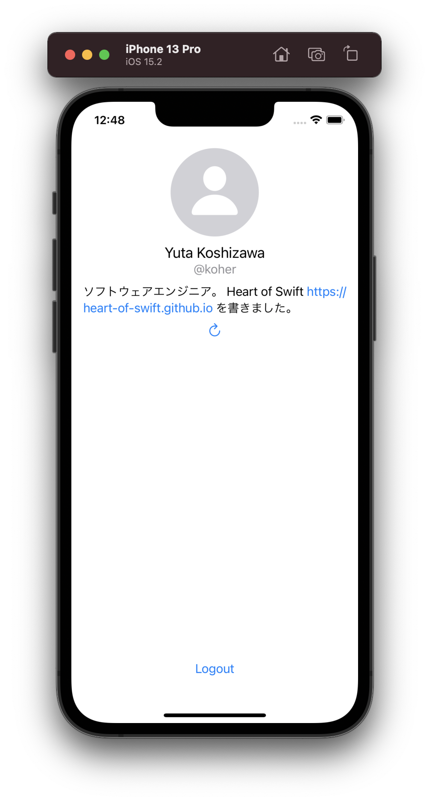
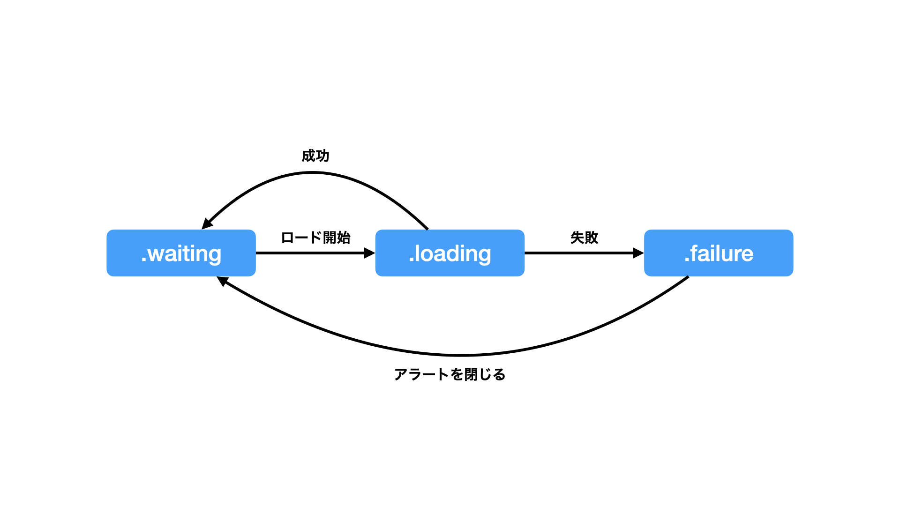
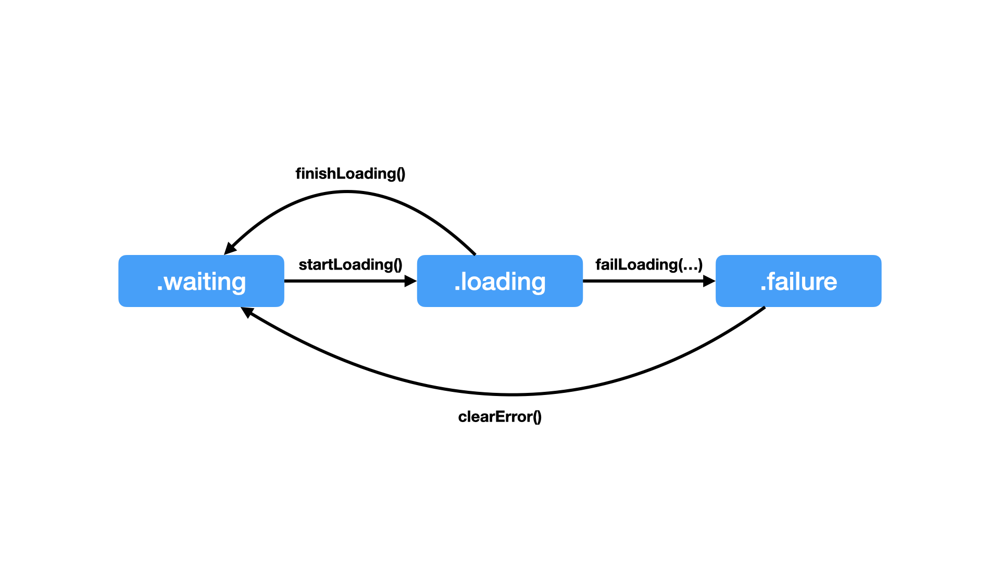
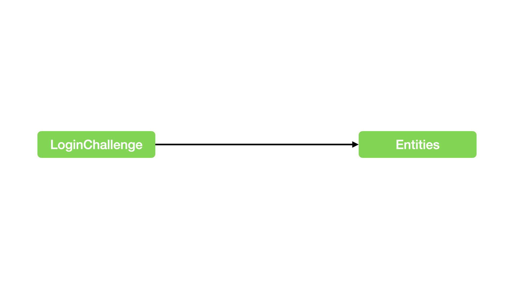
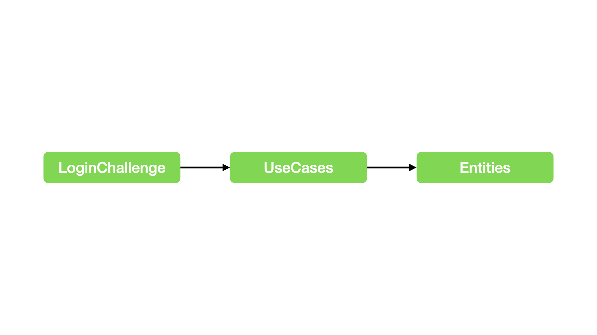
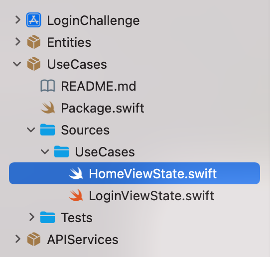
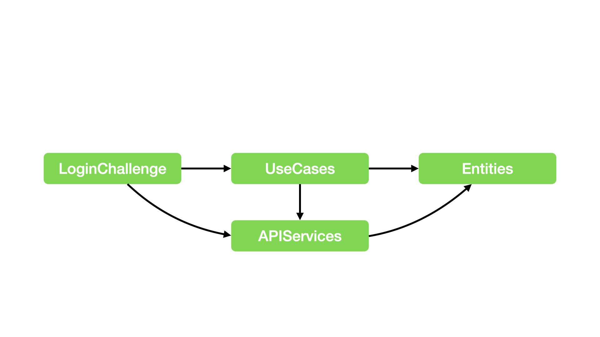

# Login Challenge

## Yuta Koshizawa **@koher**

---

## 目標

- コードの見通しを良くする
    - View からロジックを分離
    - 状態遷移をわかりやすく
    - 依存関係をわかりやすく
- コードの品質を担保する
    - 単体テストの導入

---

## Login ではなく Home について説明します🙏

---



---

## View からロジックを分離 (Before)

```swift
struct HomeView: View {
    @State private var user: User?
    ...
    var body: some View {
        ...
        Text(user?.name ?? "User Name")
        ...
    }
    ...
}
```

View の中に状態が記述されている。

---

## View からロジックを分離

---

## View からロジックを分離 (Before)

```swift
do {
    // API を叩いて User を取得。
    let user = try await UserService.currentUser()

    // 取得した情報を View に反映。
    self.user = user
} catch ... {
    ...
}
```

画面表示時に View から API を叩いて `user` を更新している。

---

## View からロジックを分離 (Before)

```swift
struct HomeView: View {
    @State private var user: User?
    ...
    var body: some View {
        ...
        Text(user?.name ?? "User Name")
        ...
    }
    ...
}
```

---

## View からロジックを分離 (After)

```swift
struct HomeView: View {
    @StateObject private var state: HomeViewState
    ...
    var body: some View {
        ...
        Text(state.user?.name ?? "User Name")
        ...
    }
    ...
}
```

ViewModel 的なクラスに状態を保持させる。

---

## View からロジックを分離 (After)

```swift
@MainActor
public final class HomeViewState: ObservableObject {
    @Published public var user: User?
    ...
}
```

ViewModel 的なクラスに状態を保持させる。

---

## View からロジックを分離 (After)

```swift
@MainActor
public final class HomeViewState: ObservableObject {
    @Published public private(set) var user: User?
    ...
}
```

`user` は内部からしか更新しないので `private(set)` に。

---

## View からロジックを分離 (After)

```swift
public func loadUser() async {
    ...
    do {
        // API を叩いて User を取得。
        let user = try await UserService.currentUser()

        // 取得した情報を View に反映。
        self.user = user
    } catch ... { ... }
}
```

`user` をロードするロジックも `state` 側に記述する。

---

## View からロジックを分離 (After)

```swift
@MainActor
public final class HomeViewState: ObservableObject {
    @Published public private(set) var user: User?
    ...
}
```

`user` は `@Published` なので、 `user` が更新されると `objectWillChange` が発火して View に反映される。

---

## View からロジックを分離 (After)

```swift
struct HomeView: View {
    ...
    var body: some View {
        ZStack {
            ...
        }
        .task {
            await state.loadUser()
        }
    }
}
```

View から `state` の `loadUser` を呼び出す。

---

## View からロジックを分離 (After)

```swift
// リロードボタン
Button {
    Task {
        await state.loadUser()
    }
} label: { ... }
.disabled(state.isLoadingUser)
```

View から `state` の `loadUser` を呼び出す。

---

## View からロジックを分離 (After)

```swift
@MainActor
public final class HomeViewState: ObservableObject {
    ...
    @Published public private(set)
        var isLoadingUser: Bool = false
    ...
}
```

ロード中かどうかも `state` 側で制御する。

---

## View からロジックを分離 (After)

```swift
public func loadUser() async {
    // 処理が二重に実行されるのを防ぐ。
    if isLoadingUser { return }
    // 処理中はリロードボタン押下を受け付けない。
    isLoadingUser = true
    defer {
        // リロードボタン押下を再度受け付けるように。
        isLoadingUser = false
    }
    ...
}
```

ロード中かどうかも `state` 側で制御する。

---

## View からロジックを分離 (After)

```swift
@MainActor
public final class HomeViewState: ObservableObject {
    ...
    @Published public
        var presentsNetworkErrorAlert: Bool　= false
    ...
}
```

`loadUser` のエラーハンドリングでネットワークエラーのアラートを表示する。

---

## View からロジックを分離 (After)

```swift
public func loadUser() async {
    ...
    do {
        ...
    } catch let error as NetworkError {
        ...
        presentsNetworkErrorAlert = true
    } ...
}
```

`loadUser` のエラーハンドリングでネットワークエラーのアラートを表示する。

---

## 状態遷移をわかりやすく

---



---

## 状態遷移をわかりやすく

```swift
private enum LoadingUserState {
    case waiting
    case loading
    case failure(Error)
}
```

各状態を `enum` の `case` で表現する。

---

## 状態遷移をわかりやすく

```swift
private enum LoadingUserState {
    ...
    mutating func startLoading() {
        guard case .waiting = self else {
            assertionFailure()
            return
        }
        self = .loading
    }
}
```

状態遷移を `enum` のメソッドで表現する。

---

## 状態遷移をわかりやすく

```swift
private enum LoadingUserState {
    ...
    mutating func startLoading() { ... }
    mutating func finishLoading() { ... }
    mutating func failLoading(with error: Error) { ... }
    mutating func clearError() { ... }
}
```

状態遷移の矢印それぞれに対応したメソッドを実装する。

---



---

## 状態遷移をわかりやすく (Before)

```swift
public final class HomeViewState: ObservableObject {
    @Published public private(set)
        var isLoadingUser: Bool = false
    ...
    @Published public
        var presentsNetworkErrorAlert: Bool = false
    @Published public
        var presentsServerErrorAlert: Bool = false
    ...
}
```

ロードの状態が様々なプロパティに分散して扱われている。

---

## 状態遷移をわかりやすく (After)

```swift
public final class HomeViewState: ObservableObject {
    @Published private var loadingUserState:
        LoadingUserState = .waiting
    ...
}
```

`loadingUserState` で一元的に状態を管理する。内部的な状態なので `private` にする。

---

## 状態遷移をわかりやすく (After)

```swift
public final class HomeViewState: ObservableObject {
    ...
    public var isLoadingUser: Bool {
        guard case .loading = loadingUserState else {
            return false
        }
        return true
    }
    ...
}
```

各プロパティは `loadingUserState` を使って実装する。

---

## 状態遷移をわかりやすく (After)

```swift
public final class HomeViewState: ObservableObject {
    ...
    public var presentsNetworkErrorAlert: Bool {
        get {
            guard case .failure(is NetworkError)
                = loadingUserState else { return false }
            return true
        }
        set { loadingUserState.clearError() }
    }
    ...
}
```

---

## 状態遷移をわかりやすく (Before)

```swift
public func loadUser() async {
    // 処理が二重に実行されるのを防ぐ。
    if isLoadingUser { return }
    // 処理中はリロードボタン押下を受け付けない。
    isLoadingUser = true
    ...
}
```

以前は各プロパティを直接変更していた。

---

## 状態遷移をわかりやすく (After)

```swift
public func loadUser() async {
    // 処理が二重に実行されるのを防ぐ。
    if isLoadingUser { return }
    // 処理中はリロードボタン押下を受け付けない。
    loadingUserState.startLoading()
    ...
}
```

`loadingUserState` で一元的に状態遷移を管理する。メソッド経由で状態遷移させるので不正な遷移が起こらない。

---

## 依存関係をわかりやすく

---



---

## 依存関係をわかりやすく

ViewModel 的なクラス（ `HomeViewState` など）は View とは別モジュールに切り出したい。

- 依存関係が最小限に整理されていると、登場人物が少なくコードの見通しが良くなる
- ロジックを扱うモジュールを分離しておくと、そこだけビルドして高速にテストを実行可能

---



---



---

## 依存関係をわかりやすく

```swift
let package = Package(
    name: "UseCases",
    ...
    dependencies: [
        .package(path: "../Entities"),
        ...
    ],
    ...
)
```

依存関係を Package.swift に記述する。

---


---

## 依存関係をわかりやすく

`HomeViewState` は `UserService` や `AuthService` を利用しており、それらは `APIServices` モジュールが提供している。

---



---

## 依存関係をわかりやすく

`UseCases` モジュールが `APIServices` モジュールに依存するのは望ましくない。

- `UseCases` が純粋なロジックの世界でなくなる
    - テストしづらい

---


---


---


---

## 依存関係逆転の原則
### Dependency Inversion Principle (DIP)

---


---


---

## 依存性の注入
### Dependency Injection (DI)

---

## 依存関係をわかりやすく (After)

```swift
public protocol UserServiceProtocol {
    static func currentUser() async throws -> User
}
```

`UseCases` モジュールで `UserServiceProtocol` を宣言する。

---

## 依存関係をわかりやすく (Before)

```swift
import APIServices

public final class HomeViewState: ObservableObject {
    public func loadUser() async {
        ...
        let user = try await UserService.currentUser()
        ...
    }
}
```

元々は `APIServices` モジュールに依存していた。

---

## 依存関係をわかりやすく (After)

```swift
public final class HomeViewState<UserService>:
        ObservableObject
        where UserService: UserServiceProtocol {
    public func loadUser() async {
        ...
        let user = try await UserService.currentUser()
        ...
    }
}
```

`HomeViewState` は注入された `UserService` を利用する形に。

---

## 依存関係をわかりやすく (Before)

```swift
let package = Package(
    name: "UseCases",
    ...
    dependencies: [
        .package(path: "../Entities"),
        .package(path: "../APIServices"),
        ...
    ],
    ...
)
```

`UseCases` は元々 `APIServices` に依存していた。

---

## 依存関係をわかりやすく (After)

```swift
let package = Package(
    name: "UseCases",
    ...
    dependencies: [
        .package(path: "../Entities"),
        ...
    ],
    ...
)
```

`UseCases` の Package.swift から `APIServices` への依存を除去。

---

## 依存関係をわかりやすく (Before)

```swift
let package = Package(
    name: "APIServices",
    ...
    dependencies: [
        .package(path: "../Entities"),
    ],
    ...
)
```

`APIServices` は元々 `Entities` だけに依存していた。

---

## 依存関係をわかりやすく (After)

```swift
let package = Package(
    name: "APIServices",
    ...
    dependencies: [
        .package(path: "../Entities"),
        .package(path: "../UseCases"),
    ],
    ...
)
```

`APIServices` を `UseCases` にも依存させる。

---

## 依存関係をわかりやすく (Before)

```swift
public enum UserService {
    public static func currentUser()
            async throws -> User {
        ...
    }
}
```

---

## 依存関係をわかりやすく (After)

```swift
public enum UserService: UserServiceProtocol {
    public static func currentUser()
            async throws -> User {
        ...
    }
}
```

`UserService` を `UserServiceProtocol` に適合させる。

---


---


---

